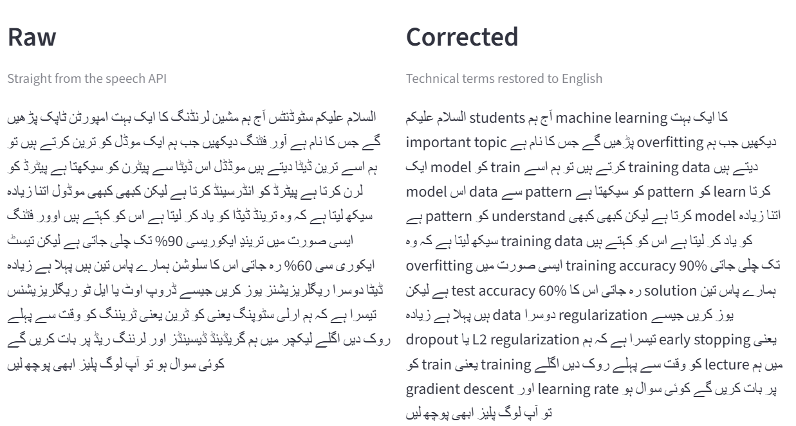
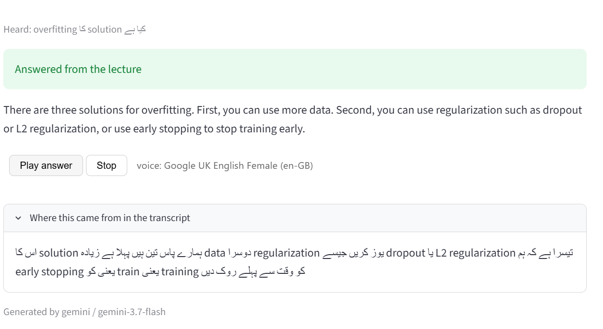
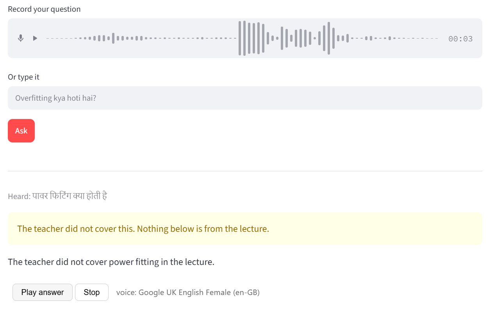
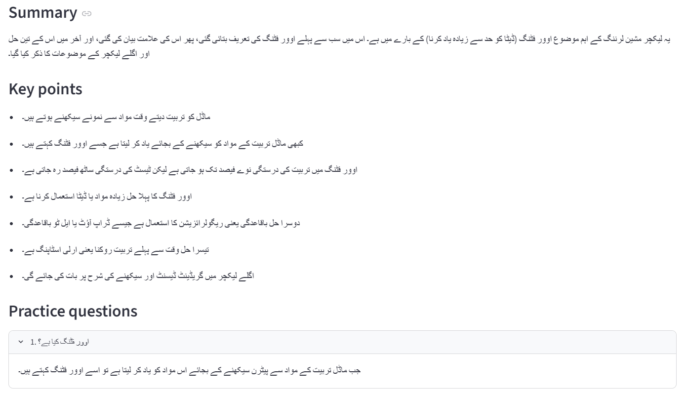
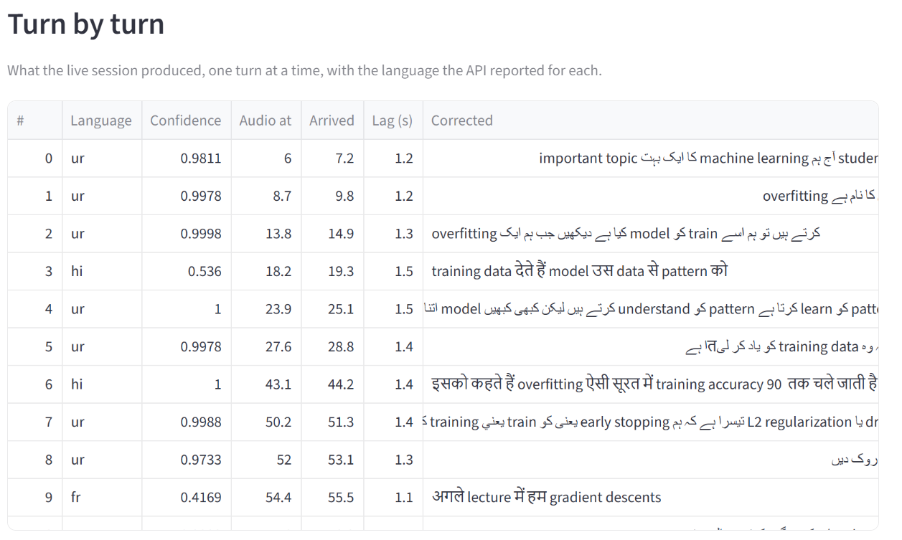
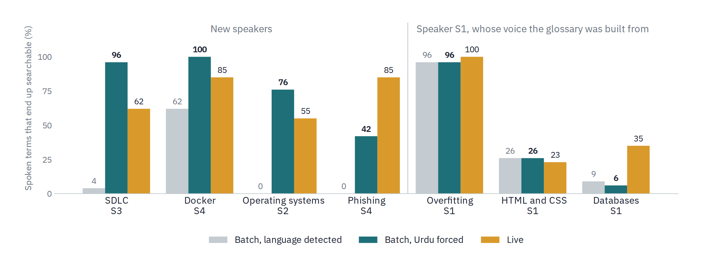
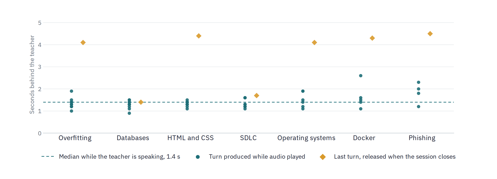
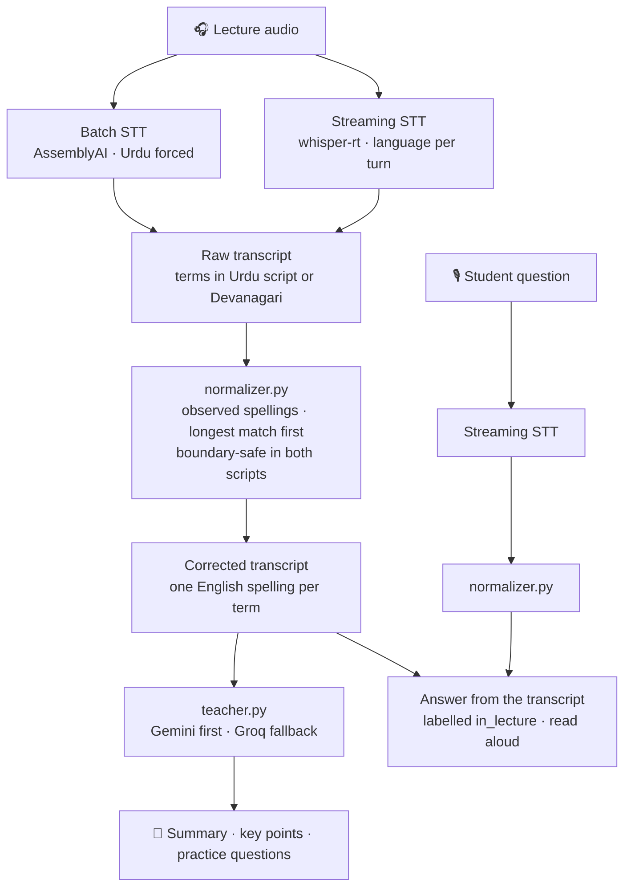
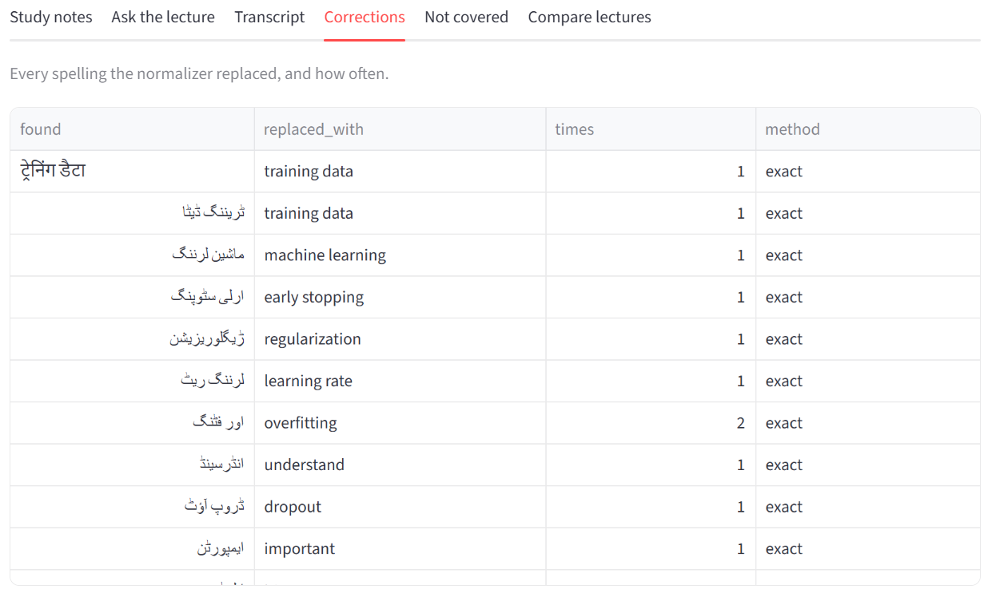

<div align="center">

# 🎓 Sabaq

### Searchable lecture notes for classrooms that mix Urdu and English

*Sabaq (سبق) — Urdu for "lesson"*

**Built for the [AssemblyAI Voice Agent Hackathon](https://lablab.ai/ai-hackathons/assemblyai-voice-agent-hackathon) on lablab.ai · September 2026**

[](https://sabaq-ai.streamlit.app/)
[](https://lablab.ai/ai-hackathons/assemblyai-voice-agent-hackathon)


</div>

<table align="center">
<tr>
<td align="center" width="25%"><h2>7</h2>scripted lectures</td>
<td align="center" width="25%"><h2>4</h2>speakers</td>
<td align="center" width="25%"><h2>49</h2>transcripts scored</td>
<td align="center" width="25%"><h2>1.4 s</h2>median live lag</td>
</tr>
<tr>
<td align="center"><h2>79%</h2>terms searchable on unseen speakers, batch with Urdu forced</td>
<td align="center"><h2>64%</h2>the same, live</td>
<td align="center"><h2>16%</h2>the same, batch detecting the language</td>
<td align="center"><h2>23% → 100%</h2>glossary effect within its subject, live</td>
</tr>
</table>

<p align="center"><sub>Forced-Urdu batch is two runs per lecture, identical. Live is three, one of them truncated; a single clean live run scores 71%.</sub></p>

<p align="center">

<br/>
<sub>The overfitting lecture: raw transcript from the speech API on the left, technical terms restored to English on the right.</sub>
</p>

---

## Contents

[The problem](#the-problem) · [What is new here](#what-is-new-here) · [What Sabaq does](#what-sabaq-does) · [Evaluation](#evaluation) · [What the evaluation found](#what-the-evaluation-found) · [Findings from the build](#findings-from-the-build) · [Problems hit](#problems-hit-and-what-they-turned-out-to-be) · [How it works](#how-it-works) · [Running it](#running-it-locally) · [Limits](#limits) · [Next](#next) · [Questions](#questions-we-expect)

---

## The problem

Teachers in Pakistan lecture in Urdu but keep technical terms in English. A real sentence from a computer science classroom:

> *"Jab hum model ko train karte hain, overfitting ho sakta hai."*

Speech APIs handle each language on its own. They do not handle both in one sentence. Running a one-minute AI lecture through AssemblyAI returned every English term written in Urdu script, spelled differently each time:

| Spoken term | What came back |
|---|---|
| model | موڈل · موڈڈل · موڈول |
| overfitting | آور فٹنگ · اوور فٹنگ |
| pattern | پیٹرن · پیٹرڈ |
| machine learning | مشین لرنڈنگ *("machine larnding")* |
| gradient descent | گریڈینڈ ڈیسینڈز |
| learning rate | لرننگ ریڈ *("learning red")* |

A student searching for **overfitting** finds nothing. The transcript is readable but not usable, and a language model reading it cannot build notes from terms it cannot recognise.

## What is new here

The task is not translating terms a speech model cannot write. The model often writes them correctly — the same speaker's *overfitting* came back as `اور فٹنگ` in turns 2 and 3 and as `overfitting` in turn 7, about thirty seconds later. The task is **making a term consistent**, because a word that is searchable in one sentence and not the next is still not searchable.

Two results carry beyond this app:

- **A correction glossary is a property of the speech model, not of the language.** Changing the model invalidates part of it (finding 15).
- **Which script the model writes depends on the speaker — unless it is told the language.** Left to detect it, the model heard one speaker as Urdu and three as Hindi, and wrote Devanagari for those three ([evaluation](#2-the-model-hears-some-speakers-as-urdu-and-others-as-hindi)). Told the language was Urdu, it wrote Urdu script for all four, and kept 79% of the new speakers' technical terms in English instead of 16% ([evaluation](#8-forcing-urdu-on-batch-fixes-three-of-the-four-new-speakers)). One API parameter did more than the whole glossary for those speakers.

## What Sabaq does

Upload or stream a lecture. Uploads are transcribed with the language forced to Urdu, which the evaluation found far better than letting the model detect it. Sabaq restores technical terms to English using a glossary of spellings observed in real output, and generates study material from the corrected text.

| | Feature |
|---|---|
| 🎙️ | **Live mode** — terms corrected turn by turn while the lecture runs, with the detected language shown per turn |
| ❓ | **Ask the lecture by voice** — the answer is read aloud, grounded in the transcript, and labelled when the teacher did not cover it |
| 🔍 | **Raw and corrected transcripts** side by side, with a table of every correction |
| 📝 | **Summary, key points and five practice questions**, in English or Urdu |
| 🔤 | **Three term styles** — English terms, Urdu terms, or Urdu with English in brackets |
| 📊 | **Lecture comparison** — shows where the glossary holds and where it does not |
| 🧾 | **Not-covered report** — leftover words in both scripts, which is how the glossary grows |
| 📚 | **Starter glossaries for six more subjects** — selectable in the sidebar |

<table>
<tr>
<td width="50%" valign="top"><br/><sub>A spoken question, answered only from the lecture, with the sentence it came from.</sub></td>
<td width="50%" valign="top"><br/><sub>A topic the teacher never covered: Sabaq says so instead of answering from general knowledge.</sub></td>
</tr>
</table>

<p align="center">

<br/>
<sub>Study notes from the corrected transcript: summary, key points and practice questions.</sub>
</p>

> [!NOTE]
> **Glossaries.** The AI / ML glossary is the evaluated one. Six starter glossaries — database, web development, software engineering, cloud computing, cybersecurity and operating systems — add 41 core terms (55 spellings in Urdu script and Devanagari), each observed in the evaluation recordings and each the same word in another script. They were built from the recordings they would be tested on, so they are **not part of the evaluation** and no accuracy is claimed for them. They show how the glossary extends to a new subject; a full one needs more speakers and a held-out lecture.

---

## Evaluation

Seven lectures, scripted before recording, from four speakers across seven computer science subjects. Every file was transcribed twice on the batch path with the language detected, twice on batch with Urdu forced, and three times on the live path — 49 transcripts in all. Seven further live runs, one per lecture, measured lag (finding 19); they are kept in [`eval_runs_lag/`](eval_runs_lag/) so the scored set stays as published.

**Ground truth.** `ground_truth.py` lists every English term each speaker said and how many times, so every correction count has a denominator. The new speakers did not read their scripts word for word; where the batch and live transcripts agree that something different was said, the count follows what was said.

**The glossary was frozen** (hash `566f8f312c1e`, tag `glossary-v1`) before the four new lectures were transcribed, and has not changed since. Fuzzy matching was off throughout.

For each transcript the scorer counts technical terms **already in English** from the speech model, terms **brought to English by the glossary**, and terms **still missed**. Recall is the share of spoken terms that end up searchable. Precision is the share of glossary replacements that produced a term the speaker actually said.

### Results by lecture

| Lecture | Speaker | Relation to glossary | Terms spoken | Batch, language detected | Batch, Urdu forced | Live |
|---|---|---|:-:|:-:|:-:|:-:|
| Overfitting | S1 | built from this recording | 26 | 96% | 96% | **100%** |
| Primary and foreign keys | S1 | same speaker, new subject | 34 | 9% | 6% | **35%** |
| HTML and CSS | S1 | same speaker, new subject | 31 | **26%** | **26%** | 23% |
| SDLC | S3 | new speaker, new subject | 26 | 4% | **96%** | 62% |
| Docker and containers | S4 | new speaker, new subject | 26 | 62% | **100%** | 85%\* |
| Phishing attack | S4 | new speaker, new subject | 26 | 0% | 42% | **85%** |
| Process management | S2 | new speaker, new subject | 29 | 0% | **76%** | 55% |

<sub>\* Runs 1 and 3. Run 2 stopped silently after its first turn and scored 0% — see [evaluation finding 6](#6-repeated-runs-are-mostly-stable).</sub>

### Pooled

| Split | Path | Transcripts | Terms expected | Already English | Fixed by glossary | **Recall** | Glossary precision |
|---|---|:-:|:-:|:-:|:-:|:-:|:-:|
| Built from this recording | batch, detected | 2 | 52 | 0% | 96% | **96%** | 100% |
| Built from this recording | batch, Urdu forced | 2 | 52 | 0% | 96% | **96%** | 100% |
| Built from this recording | live | 3 | 78 | 23% | 77% | **100%** | 100% |
| Same speaker, new subject | batch, detected | 4 | 130 | 12% | 5% | **17%** | 100% |
| Same speaker, new subject | batch, Urdu forced | 4 | 130 | 12% | 3% | **15%** | 78% |
| Same speaker, new subject | live | 6 | 195 | 29% | 0% | **29%** | 80% |
| New speaker, new subject | batch, detected | 8 | 214 | 16% | 0% | **16%** | — |
| New speaker, new subject | batch, Urdu forced | 8 | 214 | 79% | 0% | **79%** | 100%‡ |
| New speaker, new subject | live | 12 | 321 | 64% | 0% | **64%** | — |

<sub>‡ The same two everyday words in each run. Precision on the new speakers' technical terms is still untested.</sub>

> [!IMPORTANT]
> **Scope.** Seven one-minute scripted lectures, four speakers, one speech vendor. Every number above is bounded by that. The glossary holds AI vocabulary only, so the six other subjects measure what the speech model does unaided. The 100% on the AI lecture measures how completely that recording was harvested, not how the glossary generalises; it is kept here labelled as what it is.

Full per-transcript tables are in [`results/eval_table.md`](results/eval_table.md); every transcript is in [`eval_runs/`](eval_runs/).

---

## What the evaluation found

### 1. Streaming beats batch on unseen speakers — when batch detects the language itself

On the four new lectures, the streaming model (whisper-rt) wrote **64%** of technical terms in English on its own. The batch model, left to detect the language, wrote **16%**. The one exception is the web lecture, where the two paths were close (26% batch, 23% live). Forcing Urdu on batch reverses the ranking on three of the four new lectures (finding 8).

### 2. The model hears some speakers as Urdu and others as Hindi

Batch transcribed all four new lectures **entirely in Devanagari**, from the first word — `ऑपरेटिंग सिस्टम`, `राउंड रोबिन`, `फायरवॉल`. For S1 it wrote Urdu script. The live model's per-turn language labels agree:

| Speaker | Turns labelled Urdu (`ur`) | Other labels |
|---|:-:|---|
| S1 — three lectures | **27 of 37** | `hi`, `en`, one `fr` |
| S2 — operating systems | **0 of 7** | `en` 5, `hi` 2 |
| S3 — SDLC | 2 of 11 | `hi` 5, `en` 4 |
| S4 — cloud and cybersecurity | **0 of 11** | `hi` 6, `en` 5 |

<sub>Labels were identical across repeated runs, apart from one run with a turn fewer and the truncated run.</sub>

<p align="center">

<br/>
<sub>Live mode: each turn arrives corrected, labelled with the language the model heard.</sub>
</p>

Two models, one reporting labels and one choosing a script, agree that the classification follows the speaker. This does not mean the speakers spoke Hindi: spoken Urdu and Hindi are close enough that the model cannot separate them, and something about each voice tips it one way. The consequence is practical — a glossary of Urdu-script spellings misses three of four speakers entirely. That is what the model chooses when it detects the language. Told the language is Urdu, batch writes Urdu script for all four speakers (finding 8); the live model accepts no language setting, so live mode cannot be steered this way.

### 3. Batch deletes the sentences with the most English terms — when it detects Hindi

Every new lecture's batch transcript is missing whole stretches, several of them cut mid-word, and they are always the densest technical passages. The same cuts appear on both batch runs. Live kept all of them.

| Lecture | Where batch cuts | What is missing |
|---|---|---|
| SDLC | `…करना चाहिए। उसके बाद मिलता है` | system design, coding, testing and its three levels; the closing sentence on Git, branches, pull requests, version control |
| Operating systems | `थोड़ा-थोड शॉर्टेस्ट` | execution time, CPU scheduling, first come first serve; the ending |
| Docker | `एरर्स आ जात सबसे पहले` | what Docker does, dependencies, container |
| Phishing | `ट्रस्ट मिसाल` · `हमेशा बच जो कंपनीज` | identity, sensitive information; URL, attachments, two-factor authentication |
| Database | *(same pattern)* | a sentence on relations, and the ending on normal forms and query optimization |

This is why batch returns about a quarter fewer words than live on the new lectures: 474 against 635 pooled, from 18% fewer on Docker to 34% on SDLC (101 against 152).

The deletions go with the Hindi detection, not with batch as such. Forced to Urdu, batch returned 649 words for the same four lectures — slightly more than live — and system design, Git, pull requests, CPU scheduling, URLs and attachments all came back (finding 8). With detection on, the upload path loses exactly the material a student most needs, which is why it now forces Urdu.

### 4. The glossary closes the gap within its subject, and adds nothing outside it

| | Already English | After glossary |
|---|:-:|:-:|
| AI lecture, live | 23% | **100%** |
| AI lecture, batch | 0% | **96%** |
| Four new subjects, any path | 16–79% | +0% |

Only seven glossary replacements in 49 transcripts produced a wrong result, all the same half-term: the database lecture's *database* came back as `ڈیٹا بیس` in all three live runs and twice in each forced-Urdu batch run, and the glossary, knowing only the batch spelling, turned it into `data بیس`. That is finding 15 happening again. On the new speakers the glossary replaced no technical terms at all — two everyday words in each forced-Urdu phishing run, both right — so its precision on unseen voices is untested, not proven.

### 5. Some errors are substitutions, and no glossary can undo them

The model sometimes hears a different real word:

| Spoken | Transcribed |
|---|---|
| coding | recording |
| version control | variant control |
| running program | **training** program — a false technical term in an OS lecture |
| shortest job first | shortest go first |
| round robin | round ribbon |
| phishing attack | phishy attack |
| query optimization | security optimization |

There is no misspelling to correct, so these are a limit of the approach, not a gap in the list.

### 6. Repeated runs are mostly stable

| Path | Result across repeats |
|---|---|
| Batch, 7 lectures × 2 | recall identical on all 7; word count identical on 6 |
| Live, 7 lectures × 3 | recall identical on 6 of 7; word count identical in 19 of 21 runs |
| Live, a fourth run of each lecture, after the drain was shortened | text identical to run 1, character for character, on all 7 |
| Batch with Urdu forced, 7 lectures × 2 | recall and word count identical on all 7 |

The exception is real: one live session of the Docker lecture delivered its first turn — 39 words, word for word the same as the other runs up to that point — and then nothing, with no error. The evaluation did not save server warnings or the amount of audio the server reported receiving, so the cause cannot be recovered from these files. Both are now saved with every live run, and the app warns when the server heard less audio than was sent. The one batch word-count difference (database, 137 against 145) spans an eleven-day gap between runs, so it may reflect a model update rather than randomness.

### 7. Measuring found what reading did not

Checking outputs by eye had missed four things the scorer surfaced: batch dropping sentences, the `ڈیٹا بیس` half-term, *query* heard as *security*, and a boundary bug in the normalizer itself — Python's `\w` does not treat Devanagari vowel signs as part of a word, so the variant `डाट` matched inside `डाटाबेस` and produced `dataाबेस`. The bug was fixed with results recorded before and after (finding 16).

### 8. Forcing Urdu on batch fixes three of the four new speakers

Every batch transcript of the three new speakers had been detected as Hindi. The same audio, with the language forced to Urdu (`language_code="ur"`), two runs each:

| Lecture | Speaker | Recall, detected | Recall, Urdu forced | Recall, live | Words, detected / forced / live |
|---|---|:-:|:-:|:-:|:-:|
| SDLC | S3 | 4% | **96%** | 62% | 101 / 157 / 152 |
| Docker and containers | S4 | 62% | **100%** | 85% | 132 / 167 / 161 |
| Process management | S2 | 0% | **76%** | 55% | 101 / 146 / 145 |
| Phishing attack | S4 | 0% | 42% | **85%** | 140 / 179 / 177 |
| **New speakers, pooled** | | **16%** | **79%** | **71%** | **474 / 649 / 635** |
| Overfitting | S1 | 96% | 96% | 100% | 157 / 157 / 158 |
| HTML and CSS | S1 | 26% | 26% | 23% | 137 / 137 / 148 |
| Primary and foreign keys | S1 | 9% | 6% | 35% | 137–145 / 153 / 164 |

<sub>Both forced-Urdu runs gave the same word counts and recall. Live is run 1; runs 1 and 3 and the fourth lag run agree, and run 2 is the truncated one.</sub>

<p align="center">

<br/>
<sub>Spoken technical terms that end up searchable, by lecture: batch with the language detected, batch with Urdu forced, and live.</sub>
</p>

Forced to Urdu, the model wrote Urdu script, apart from the last sentences of the Docker lecture, where 25 connecting words switched to Devanagari while the terms stayed in Latin script. For SDLC, Docker and operating systems it kept the technical terms in Latin script — `Operating System`, `Process Management`, `Software Development Life Cycle` — and the passages that detection had dropped came back with them. Phishing is the exception: forced Urdu writes most of its terms as Urdu-script transliterations, the pattern S1 always shows, and live stays well ahead.

For S1, forcing Urdu changed nothing on two lectures: the output was identical, character for character, which is the result finding 1 of the build recorded. On the database lecture it removed the switch to Devanagari but scored slightly lower, because *database* came back as the `ڈیٹا بیس` half-term twice (finding 4).

The upload path now forces Urdu by default, with detection as an option. The starter glossaries were harvested from detected output, which for the new speakers was Devanagari, so on forced-Urdu transcripts they rarely apply; on the phishing lecture they add nothing.

---

## Findings from the build

Tagged **[R]** for a research finding that transfers beyond this app, **[E]** for an engineering decision. *Single observation* marks a finding seen once and not yet repeated.

<details>
<summary><b>Show all 19 findings</b></summary>

<br/>

**1. [E] Language detection works — for one speaker.** Auto-detect and forced Urdu produced identical output on S1's AI lecture, so the language selector was removed. That test predated the other speakers. For them, detection chose Hindi on all eight batch transcripts, and forcing Urdu raised batch recall from 16% to 79% (evaluation, finding 8). The selector is back, with Urdu as the default.

**2. [R] word_boost does not help.** Passing the full technical vocabulary with `boost_param="high"` changed one word out of roughly 30 mangled terms, and changed it for the worse. Verified by marking the running build before drawing the conclusion.

**3. [R] Spelling can vary between runs — rarely.** The same audio once produced تریننگ on one run and ترینڍ on the next, which is why the glossary keeps variant lists. Measured later across seven lectures, repeated batch runs gave identical recall every time (evaluation, finding 6), so variation between runs is real but uncommon.

**4. [R] Fuzzy matching is unsafe here.** A similarity fallback corrupted تین (*three*) into *train* at 0.86. Urdu technical transliterations sit too close to ordinary short Urdu words. Shipped off by default, kept as a toggle so the failure stays visible.

**5. [R] Full Urdu translation is worse than mixing.** Translating terms produced academic vocabulary no Pakistani CS student uses (مشین کی خودکار تعلم for machine learning, میلانِ نزول for gradient descent) and switched to Urdu numerals, which breaks search again. The technically complete option is the unusable one.

**6. [E] Model availability moves.** `gemini-2.5-flash` was retired for new users during this build. Models are now found with a listing call that costs no generation quota, and the first working one from a preference list is used. `GEMINI_MODEL` pins one.

**7. [R] The script the model writes depends on the speaker.** First seen as a single database lecture that flipped from Urdu script to Devanagari mid-sentence. The evaluation turned it into a measured pattern: batch wrote three new speakers entirely in Devanagari, and the live model labelled none of two speakers' turns as Urdu (evaluation, finding 2). It holds only when the model chooses the language: forced to Urdu, batch wrote Urdu script for all four speakers (evaluation, finding 8).

**8. [R] Acronyms and names survive; ordinary terms do not.** The web lecture returned HTML, CSS, JavaScript, DOM Events, Media Query and Responsive Design in Latin script unprompted — all 8 of its terms that survived batch. The Docker lecture repeated the pattern: 62% on batch, mostly brand names (Docker, Kubernetes, GitHub, DevOps), against 0% for the same speaker's phishing lecture. Still inconsistent within a file: CSS appeared as both `CSS` and `سی ایس ایس`.

**9. [R] Short tags collapse.** *Single observation.* "h1 tag" came back as `پی ای ٹیگ` ("P A tag") — digit and letter both gone.

**10. [E] Two note generators, chosen for opposite reasons.** Gemini runs first because it writes better Urdu. Groq is the fallback because it is the larger floor: Gemini's free tier allows 20 generation requests a day per model, Groq's allows hundreds to thousands. Either key alone runs the app. A key that was set but unusable — the `groq` package missing from `requirements.txt` — looked like success, so the sidebar now reports each provider separately.

**11. [E] Only one streaming model can hear this classroom.** `u3-rt-pro` and `universal-streaming-multilingual` cover six European languages and cannot transcribe Urdu. `whisper-rt` covers 99 languages including Urdu, detects the language itself, and reports it per turn — which is how the script behaviour in finding 7 became measurable.

**12. [E] A grounded answer has to say when it is not grounded.** The question path returns `in_lecture` and the transcript span the answer rests on. The student's question runs through the normalizer first, so a question transcribed as آور فٹنگ still finds a transcript corrected to *overfitting*.

**13. [E] The voice out is the browser, not an API.** A ur-PK voice ships with Windows, Android and macOS; hosted TTS on both providers is English-first and would spend scarce quota. The component reports which voice it used rather than failing quietly into an English voice reading Urdu. A Hindi voice is not used as a fallback: it cannot read Urdu script.

**14. [R] The streaming model writes terms in English by itself, but not reliably.** On the AI lecture the same speaker's *overfitting* appeared as `اور فٹنگ` in turns 2 and 3 and as `overfitting` in turn 7, identically on every live run. Measured: 23% of the AI lecture's terms came back in English unaided for S1, against 55–85% for the three new speakers.

**15. [R] The glossary is specific to the model that produced it.** Built from batch output, it corrected 13 term instances on a streaming transcript of the same lecture. One harvest pass over the app's own not-covered report took it to 25. The evaluation found the same effect again in the database lecture (finding 4 above).

**16. [R] Devanagari variants match without a transliteration bridge — with one correction.** A planned transliteration step proved unnecessary: Devanagari spellings added to the glossary match through the same pass. But `\w` does not include combining vowel signs, so a variant could match inside a longer Devanagari word. Found by the evaluation and fixed; the boundary now includes vowel signs and Urdu diacritics.

**17. [R] Coverage is mostly stable, with occasional silent truncation.** Early testing saw one file give 6 turns and then 12. Measured across 21 live runs, word counts matched in 19; one session stopped after its first turn with no error (evaluation, finding 6).

**18. [R] Language detection can leave the language pair.** The AI lecture's turns were labelled `ur` ×9, `hi` ×2 and `fr` ×1 — the French label reproduced on all three runs. Confidence flags a confused turn but does not predict a script switch: one fully Devanagari turn was labelled Hindi at 1.00.

**19. [R] Live text trails the teacher by about 1.4 seconds, and the gap does not grow.** Measured from word timestamps on one live run of each lecture ([`eval_runs_lag/`](eval_runs_lag/)): the 59 turns produced while audio was playing arrived a median 1.4 s after their last word was sent, from 0.9 to 2.6 s, and 56 of the 59 under 2 s. The median was the same in the first and second half of the lectures. The final turn usually waits for the session to close and arrives about 4 s after the audio ends (4.1–4.5 s in five lectures; in the other two it arrived on its own, under 2 s). An earlier version of this finding reported a steady 2.5 s from a metric that measured the connection time instead: the same to 0.1 s on every turn of a run, 0.7–4.1 s between runs.

</details>

<p align="center">

<br/>
<sub>Finding 19: seconds between the teacher speaking and the corrected live text, per turn. The last turn of each lecture waits for the session to close.</sub>
</p>

### The same lecture, batch against live

The AI lecture through both paths, three live runs, identical each time:

| | Batch | Live (whisper-rt) |
|---|:-:|:-:|
| Words | 157 | 158 |
| Technical terms spoken | 26 | 26 |
| Already in English from the model | 0 | 6 |
| Brought to English by the glossary | 25 | 20 |
| Missed | 1 *(a dropped "overfitting kya hai")* | 0 |
| Lag behind the teacher | n/a | 1.4 s median *(one run)* |
| Words arriving after the audio ended | n/a | 6 of 158, as one final turn |
| Languages reported | n/a | `ur` ×9, `hi` ×2, `fr` ×1 |

Of the 32 corrections on the batch transcript, 25 are technical terms and 7 are everyday words (*students, lecture, topic, important, understand, solution, learn*). The app reports the two separately.

Generated notes were checked against the transcript by the author, unblinded, on the AI lecture: every claim traced back, with one soft embellishment (*"stop before time"* became *"stop at the optimal time"*). A single-reviewer check, reported as one.

---

## Problems hit, and what they turned out to be

Recorded because several were misdiagnosed first, and the correction is the useful part.

| Symptom | Actual cause | Resolution |
|---|---|---|
| Groq key loaded, Groq never used | `groq` missing from `requirements.txt`; the `ImportError` was swallowed | Dependency added, import error kept, per-provider status in the sidebar |
| Live mode refused mp3 and mp4 | No system ffmpeg | `imageio-ffmpeg` ships a binary in the venv |
| 70% of the lecture missing from live output | Socket closed two seconds after the audio ended, while the server still held most of the transcript | Terminate the session rather than close it, and collect what Terminate releases |
| Lag reported as 4 s, then 23 s, then 30 s | The metric read the tail flushed after termination | Lag measured only on turns produced during audio — which then measured something else (next row) |
| Lag steady at 2.5 s on every turn | **Misdiagnosis.** The metric subtracted audio sent from time elapsed, and while audio is paced at real time that difference is the connection time: the same to 0.1 s within a run, 0.7–4.1 s across runs | Lag measured from each turn's word timestamps (finding 19) |
| Every live session ended with about 15 s of waiting | In none of 20 evaluation runs did a turn arrive during that wait; the final turn arrives when Terminate is sent | Terminate after 3 s of quiet; `disconnect()` already waits for the final turn. Re-run on all 7 lectures: identical text |
| Batch dropped the most term-dense sentences | **Partly a misdiagnosis.** Put down to batch transcription; it happens when the model detects the language and chooses Hindi | Uploads force Urdu, which kept every dropped passage (evaluation finding 8) |
| Half the words missing mid-stream | **Misdiagnosis.** Turns were contiguous; turn length varies up to 8× | No change; documented instead |
| `AttributeError: no attribute 'notices'` after a 90 s run | Two files updated out of step | Reader tolerates an older module |
| Devanagari half invisible in the not-covered report | Report read Urdu script only | Both scripts read and labelled |
| `database` became `data بیس` | A shorter glossary entry matched inside the compound | Longest-match entry for the compound |
| `डाटाबेस` became `dataाबेस` | `\w` excludes Devanagari vowel signs, so the word boundary fell mid-word | Boundary class includes vowel signs and diacritics |
| Batch recall of 100% on the AI lecture | **Misdiagnosis.** Ground truth was counted from the batch transcript, which had dropped a term | Recounted from the fuller transcript; batch is 96% |
| "ffmpeg failed" after a streaming timeout | The socket failed first; ffmpeg then hit a closed pipe | ffmpeg stopped cleanly; handshake failures retried |
| `PermissionError: [WinError 32]` after a streaming handshake timed out | The failed session never closed its audio source, so ffmpeg kept the temporary file open, and Windows cannot delete an open file | The session always closes its source, ffmpeg starts only on the first read, and the app retries the delete instead of failing the page |
| Handshake timeouts, 8 of 36 attempts | Likely the SDK's 1-second handshake limit (assemblyai 1.6.1), several round trips from Pakistan; not confirmed | 10 seconds per attempt; not yet re-measured |
| No Termination event on the phishing lecture, 2 of 2 sessions | Likely the SDK's 5-second wait for it; the other six lectures received it | 10-second wait, which also removes a 6-second pause the app added after it |
| `KeyError: 'AI / ML'` on every transcript; four starter glossaries could not be selected | A list of lecture labels in `app.py` reused the name of the imported glossary list and replaced it | Renamed; all six glossaries are offered |
| Groq fallback stopped at its third model *(found in review)* | Groq accepts a JSON schema on only some models; the 400 from the others was treated as fatal for the whole provider | JSON object mode, with the schema in the prompt, for those models; a refused request moves to the next model |

---

## How it works



The normalizer is what makes the teaching layer possible: a language model reading the raw transcript cannot recognise آور فٹنگ as *overfitting*.

<p align="center">

<br/>
<sub>Every replacement is listed with its count, so a correction can be checked rather than trusted.</sub>
</p>

---

## Running it locally

```bash
git clone https://github.com/hussnain-sulehri/sabaq.git
cd sabaq
python -m venv .venv
.venv\Scripts\activate          # Windows
source .venv/bin/activate       # macOS and Linux
pip install -r requirements.txt
```

Copy `.env.example` to `.env` and fill in your keys:

```ini
ASSEMBLYAI_API_KEY=your_assemblyai_key
GEMINI_API_KEY=your_gemini_key
GROQ_API_KEY=your_groq_key
GEMINI_MODEL=
GROQ_MODEL=
```

`ASSEMBLYAI_API_KEY` is required. At least one of `GEMINI_API_KEY` and `GROQ_API_KEY` is required; both enables the fallback. Leave the model variables empty for automatic selection, or set one to pin a model.

```bash
streamlit run app.py
```

<details>
<summary><b>Live mode system packages</b></summary>

<br/>

- **ffmpeg** decodes mp3, m4a and mp4 into the raw PCM the socket takes. `imageio-ffmpeg` ships a binary inside the venv, so pip alone is enough; a system ffmpeg is used when present.
- **libportaudio2** enables microphone capture. Without it the microphone option disappears and a file can still be streamed — which is how the deployed app runs, since Streamlit Cloud has no audio device.

Both are listed in `packages.txt` for Streamlit Cloud. Locally: `sudo apt install ffmpeg libportaudio2`, or `brew install ffmpeg portaudio`.

</details>

### Reproducing the evaluation

Put recordings in `lectures/`, named by the ids in `ground_truth.py` (`se_sdlc.mp3`, `os_process.wav`, …). Audio is not committed.

```bash
python evaluate.py freeze                                              # record the glossary and matching-rule hashes
python evaluate.py import runs/overfitting.json ml_overfitting        # reuse a saved app run
python evaluate.py transcribe --audio lectures --paths batch --runs 2
python evaluate.py transcribe --audio lectures --paths live --runs 3
python evaluate.py transcribe --audio lectures --paths batch_ur --runs 2
python evaluate.py score                                               # writes results/
python check_run.py os_process__live__run1                            # trace any count by hand
```

The lag runs go to their own folders so the scored set is untouched. `SABAQ_EVAL_RUNS` and `SABAQ_RESULTS` redirect them; the freeze is always read from `results/`.

```bash
SABAQ_EVAL_RUNS=eval_runs_lag SABAQ_RESULTS=results_lag python evaluate.py transcribe --audio lectures --paths live --runs 1
SABAQ_EVAL_RUNS=eval_runs_lag SABAQ_RESULTS=results_lag python evaluate.py score
```

In PowerShell, set them with `$env:SABAQ_EVAL_RUNS = "eval_runs_lag"` and `$env:SABAQ_RESULTS = "results_lag"` in the same terminal first, and remove them afterwards.

Transcripts are cached in `eval_runs/`, so scoring re-runs for free. The scorer refuses to run if the glossary, or the rules it is matched with, have changed since they were frozen. The published freeze predates the second hash; `python evaluate.py freeze` adds it without touching the glossary hash.

### Deploying

The app runs on Streamlit Community Cloud. Keys go in the app's **Secrets** settings in TOML, not in a file:

```toml
ASSEMBLYAI_API_KEY = "your_assemblyai_key"
GEMINI_API_KEY = "your_gemini_key"
GROQ_API_KEY = "your_groq_key"
```

`config.py` reads Streamlit secrets first, then the environment, so the same code runs in both places.

---

## Files

| File | What it does |
|---|---|
| `app.py` | Streamlit interface: upload, streaming, results, notes, questions |
| `live.py` | Streaming session, audio sources, per-turn language |
| `normalizer.py` | AI / ML glossary and the two correction passes |
| `subject_glossaries.py` | Starter glossaries for six more subjects |
| `teacher.py` | Prompts, provider and model selection, retries, note generation |
| `speak.py` | Reads answers aloud through the browser's own voice |
| `runs.py` | Saving runs and comparing lectures in the app |
| `config.py` | Key and setting loading |
| `ground_truth.py` | Terms each speaker said, per lecture, with the counting rules |
| `evaluate.py` | Freeze, transcribe, and score precision and recall |
| `check_run.py` | Traces one transcript's counts back to their cause |
| `results/` | Frozen glossary, scores as JSON, CSV and Markdown |
| `eval_runs/` | Every transcript the scores were computed from |
| `eval_runs_lag/`, `results_lag/` | One live run per lecture with word-timestamp lag, server audio counts and notices (finding 19) |

## Built with

Python · Streamlit · AssemblyAI Speech-to-Text (batch and streaming) · Google Gemini API · Groq API

---

## Limits

**Scope.** Seven one-minute scripted lectures, four speakers, one speech vendor. The claim that code-switched terms come back in non-Latin script is measured on AssemblyAI's batch API and whisper-rt only.

**Subject coverage.** The evaluated glossary covers AI and machine learning; on the six other subjects it added nothing. The starter glossaries for those subjects are small, built from four recordings, and unevaluated.

**Script coverage.** For three of four speakers the model wrote Devanagari, and the glossary is mostly Urdu script. Devanagari is covered only where a spelling has been observed and added.

**Substitutions.** When the model hears a different real word (*recording* for *coding*), there is nothing for a glossary to correct.

**Batch deletions.** With language detection, batch dropped the most term-dense sentences on the three speakers it heard as Hindi. Forced to Urdu, on either of two runs, it did not. Terms that are not in the transcript cannot be corrected.

**Precision on new voices is untested.** The glossary replaced no technical terms on the new speakers' lectures, on any path.

**Starter glossaries follow the script they were harvested from.** They hold mostly Devanagari spellings from detected output, so on forced-Urdu uploads they rarely apply.

**Ground truth.** The scripts for the first three lectures were not kept, so their counts come from the fuller of the batch and live transcripts. A term dropped by both paths is not counted.

**No word error rate.** The scripts are in Roman Urdu and the transcripts in Urdu script or Devanagari, so a word-level reference would first need the scripts rewritten. Term-level recall is measured instead.

**Pre-emptive guards.** ترین is not replaced after words such as اہم, where it is the superlative suffix, and فیصد was removed as a native Urdu word. Neither was observed failing.

**Biasing.** Only `word_boost` was tested. Newer keyterm biasing, if available for Urdu, was not.

**Streaming reliability.** 8 of 36 streaming connection attempts from the development network timed out at the handshake; none of 25 batch requests failed. One connected session stopped delivering after its first turn without an error. The app now compares the audio the server reports receiving with the audio sent, so a session that stops being heard is reported; one that is heard in full but returns too little text would not be. In the lag runs the server's count matched the audio sent to within half a second in 6 of 7 sessions; in the seventh, the phishing lecture, its Termination message did not arrive, so the check could not run. The same lecture missed it again in the app. The handshake and termination limits were raised after these runs and have not been re-measured.

**Quotas.** Gemini's free tier allows 20 generation requests per day per model; notes use one. Quota errors move to the next model rather than retrying, and fall through to Groq. Streaming is billed on how long the socket stays open, so every path terminates it in a `finally` block.

**Voices.** Spoken answers depend on the listener's device having a voice for the language.

**Latency.** `whisper-rt` is the slowest of the three streaming models; the fast ones do not support Urdu. Live text trails the teacher by a median 1.4 s, with the last turn about 4 s after the audio ends (finding 19).

## Next

- **Find out when live beats forced-Urdu batch.** Forced Urdu wins on three of four new lectures; live wins on phishing (85% against 42%) and on S1's database lecture. Which to trust for a new voice is still open.
- **Grow the starter glossaries into full subject glossaries** from more speakers, harvested from forced-Urdu output, which is Urdu script, and evaluate each on a held-out lecture.
- **A words-per-second check on live transcripts,** for the truncation the audio-received warning cannot see.
- **A glossary that learns** from approved corrections instead of being written by hand.
- **A second speech vendor and a word error rate benchmark.**
- **Speaker separation** so student questions are marked apart from the lecturer.
- **Search across lectures.**

## Questions we expect

**Why did you use Whisper?**
`whisper-rt` is one of AssemblyAI's own streaming models, used through the AssemblyAI Streaming API. It is the only AssemblyAI streaming model that understands Urdu; the other two cover six European languages. It also reports the language of every turn, which is how the Urdu-versus-Hindi finding was measured. Uploads use AssemblyAI batch transcription with the language forced to Urdu.

**Why not use Gemini to transcribe or fix the transcript?**
Gemini writes the notes and answers questions. Correction is done by the glossary because every replacement is deterministic, shown in the Corrections table, and measurable. It is also instant for each live turn, and it costs none of Gemini's free-tier allowance of about 20 requests a day. Correction by a language model has not been tested, and comparing it is a fair next step.

**Why not a translation API?**
The teacher already says the term in English; the task is to keep it, not translate anything. Translating terms into Urdu made things worse: academic words no student uses, and Urdu numerals that broke search (build finding 5). A translation API was not tested directly.

**Why not tell the speech model the technical terms in advance?**
AssemblyAI's `word_boost` was tested with the full vocabulary. It changed one word out of about thirty, for the worse (build finding 2). Newer keyterm biasing has not been tested.

**The glossary is built by hand. Does it scale?**
It grows from measurement, not guesses: the Not covered report lists every word left uncorrected. Spellings belong to the speech model that produced them (build finding 15), so a new model needs a new harvest. A glossary that learns from corrections teachers approve is the next step.

**Seven lectures is small.**
Yes. Every result is bounded by seven one-minute scripted lectures, four speakers and one speech vendor ([Limits](#limits)). The forced-Urdu result held identically across two runs. Real classroom recordings and more speakers are the next test.

---

<div align="center">
<sub>Model names, free-tier quotas and streaming language coverage were checked against provider documentation in September 2026 and change often.</sub>
<br/>
<sub>Built for the <a href="https://lablab.ai/ai-hackathons/assemblyai-voice-agent-hackathon">AssemblyAI Voice Agent Hackathon</a> on lablab.ai · September 2026</sub>
</div>